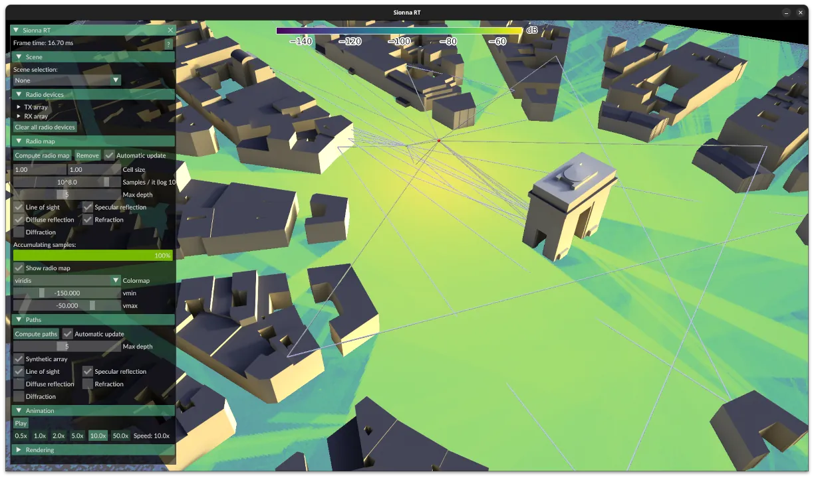

Sionna RT GUI
=============

An interactive GUI to simulate and visualize [Sionna RT](https://github.com/NVlabs/sionna-rt) scenes, paths and radio maps.




Getting started
---------------

### Installing from PyPi

```bash
python3 -m venv ./.venv
source ./.venv/bin/activate

pip install sionna-rt-gui
```

Then, start the GUI with:

```bash
sionna-rt-gui
```

Select the scene from built-in scenes with the dropdown in the top-left corner, or by passing it as an argument:

```bash
sionna-rt-gui path/to/scene.xml
```


### Installing from source

If you would like to tweak the GUI or build on top of it, you can clone this repository and install it from source:

```bash
python3 -m venv ./.venv
source ./.venv/bin/activate
pip install -r ./requirements.txt
```

Then, start the GUI with:

```bash
python ./scripts/run.py
```


Command-line options
--------------------

Explain config files (YAML format), options in `config.py`. See [`example.yaml`](configs/sionna_rt_gui/example.yaml). Pass with `--config`.

Auto-reload mode with `--watch`, useful for development.


GUI options
-----------

'?' or 'H' to show the help page with all shortcuts.

Ctrl + left / right click to add a transmitter / receiver.

Select radio device, then move it. Can create an animation by adding a sequence of positions in the selection panel.
