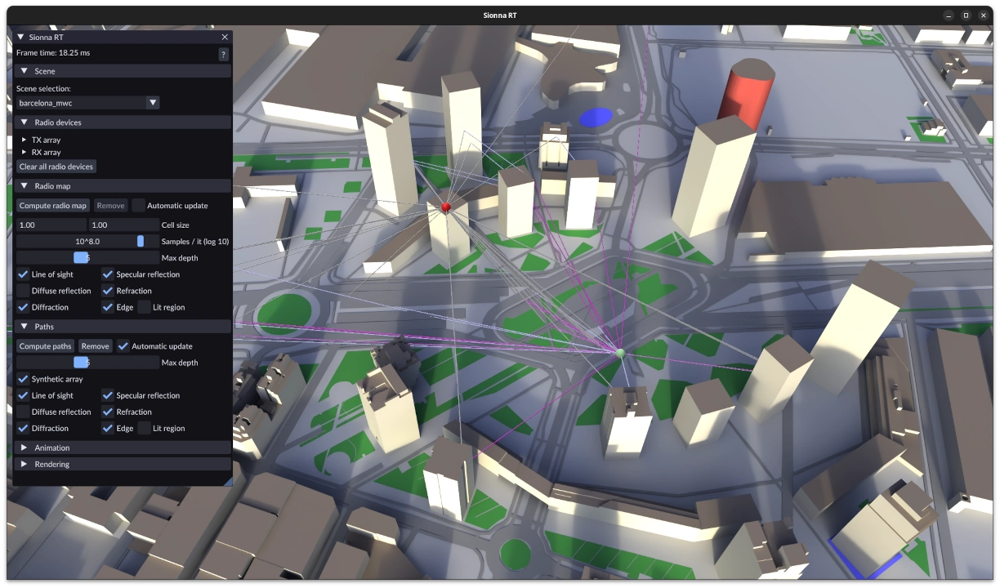

Sionna RT GUI
=============

An interactive GUI to simulate and visualize [Sionna RT](https://github.com/NVlabs/sionna-rt) scenes, paths, and radio maps.




Getting started
---------------

This project requires Python 3.10 or later. Sionna RT will be installed automatically as part of the dependencies.

### Installing from PyPI

```bash
pip install sionna-rt-gui
```

Then, start the GUI with:

```bash
sionna-rt-gui
```

Select a scene from Sionna RT's built-in scenes using the dropdown in the top-left corner, or by passing it as a command-line argument:

```bash
sionna-rt-gui path/to/scene.xml
```


### Installing from source

If you would like to tweak the GUI or build on top of it, you can clone this repository and install it from source:

```bash
python3 -m venv ./.venv
source ./.venv/bin/activate
pip install -r ./requirements.txt
```

Then, start the GUI with:

```bash
python ./scripts/run.py
```

GUI controls
------------

The left-hand window can be used to trigger and configure all simulation options for radio devices, radio maps, and paths.

Press <kbd>?</kbd> or <kbd>H</kbd> to show a help window listing supported keyboard shortcuts.

**Animations**: the position of radio devices can be animated over time. To do so,

1. Select the radio device to animate.
2. Use the transformation gizmo to place it in the scene.
3. In the Selection window, click 'Add current position'
4. Move the radio device to its next position and repeat until the trajectory is complete.

The device will move along the path when animation playback is enabled under the Animation section of the main window.


Command-line options
--------------------

### Configuration files

All available options and their defaults are defined in [`src/sionna_rt_gui/config.py`](src/sionna_rt_gui/config.py).

Almost all parameters can be set using YAML configuration files, see e.g. [`configs/sionna_rt_gui/example.yaml`](configs/sionna_rt_gui/example.yaml). Pass a config file with the `--config` argument:

```bash
sionna-rt-gui --config path/to/config.yaml
```

### Live reload mode

For development, use `--watch` to enable live code reloading:

```bash
python ./scripts/run.py --watch
```

This monitors source files and automatically reloads the GUI when changes are detected. You can also trigger a manual reload with <kbd>Shift</kbd> + <kbd>R</kbd>.


Limitations
-----------

The following features are not supported in the GUI at the moment:

- Mesh-based radio maps


Acknowledgements
----------------

This project uses the [Polyscope](https://polyscope.run) and [Dear ImGui](https://github.com/ocornut/imgui) libraries with the [Bess Dark](https://github.com/shivang51/bess/blob/a74d78e78ee4678b03582181905e00c1094c3d18/src/Bess/src/settings/themes.cpp) theme.
Sionna RT scenes use map data from [OpenStreetMap](https://www.openstreetmap.org/copyright).


License
-------

Copyright (c) 2025-2026 NVIDIA Corporation. Licensed under the Apache License 2.0. See [LICENSE](LICENSE) for details.
